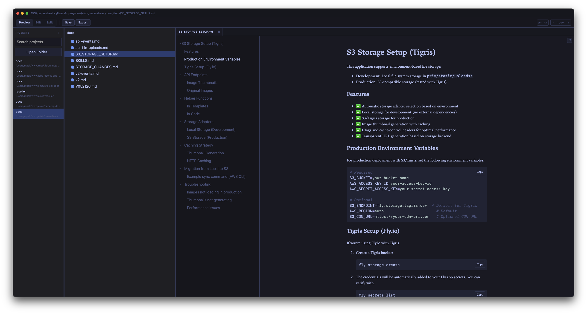
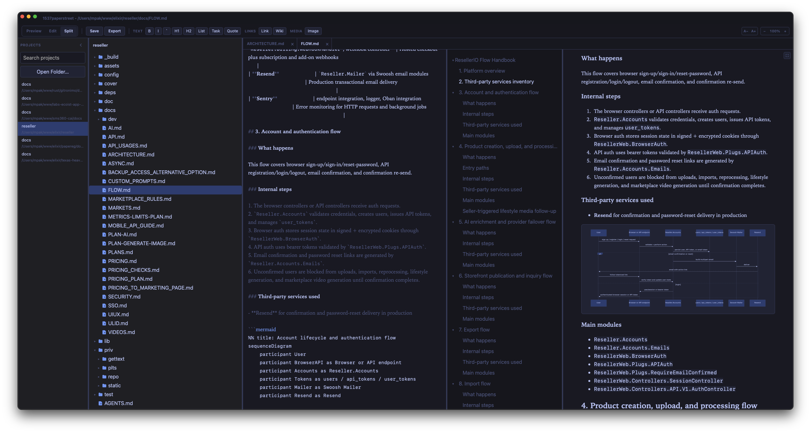
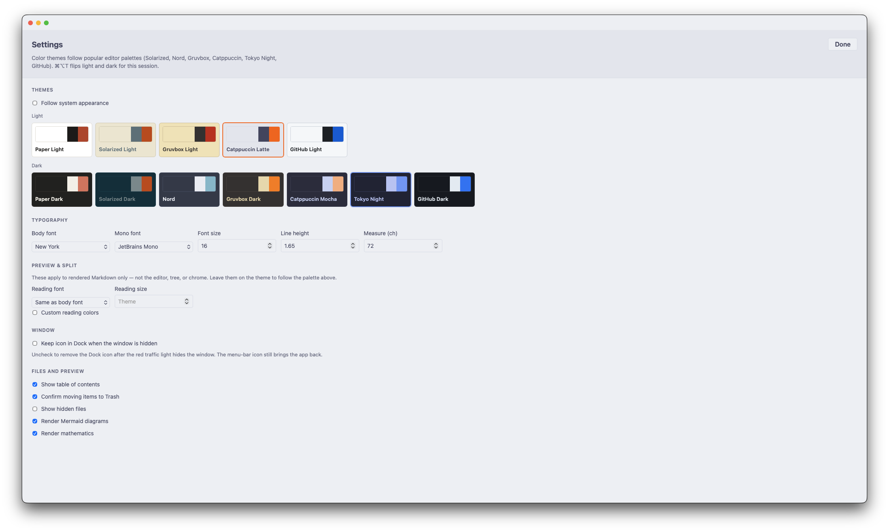

# 1537paperstreet

A local Markdown reader and editor for macOS. Open the folders you already
keep on disk. There is no account, no cloud, and no network call when you
read a document.

Made in Austin ✩ Texas · [aomega.co](https://aomega.co)

[Download the latest release](https://github.com/mpakus/1537paperstreet/releases/latest)



## Why it exists

Most Markdown tools want a vault format, a sync service, or a browser tab.
1537paperstreet is a native window over ordinary folders: notes, specs, READMEs,
and wikis that already live next to your code.

- **Your files stay yours.** Projects are paths on disk. Removing a project from
  the list does not delete the folder.
- **Read first.** Preview GitHub Flavored Markdown with a table of contents,
  tabs, and a full-size reading view. Edit the source when you need to; save
  with ⌘S.
- **Private by default.** Themes, Mermaid, and KaTeX are local. The only
  optional network request is **Check for Updates**, which asks GitHub Releases
  when you click it.

## What you can do

### Projects

Keep several folders in the **Projects** list. Search filters by name and path.

Add a folder with Open Folder…, File → Open Folder…, File → Open File…
(registers the containing folder and opens the `.md`), or drop a folder or
Markdown file from Finder onto the window. Opening the same folder again
reuses the existing entry.

If you moved a folder, the row turns dim; context menu → Find Folder… points
the record at the new location. Remove from List only drops the list entry.

⌘⇧P switches project. ⌘1 hides the Projects list; a slim strip remains so
you can open it again.

### Files

The tree loads one directory level at a time. Expanded folders and pane widths
persist. Icons distinguish folders, Markdown (`.md`, `.markdown`, `.mdown`,
`.mdwn`), and other files. ⌘2 hides the tree. ⌘P quick-opens Markdown in the
current project.

Context menu and File / Go:

| Action | How |
| --- | --- |
| New File / New Folder | ⌘N / ⌘⇧N in the selected folder |
| Rename | click the selected name again, F2, or the context menu |
| Duplicate | copy beside the original |
| Copy to… / Move to… | pick a destination folder |
| Reveal in Finder | ⌘⇧R |
| Open in External Editor | ⌘⇧O |
| Move to Trash | ⌘⌫, with confirmation |

Drag inside the tree to move; hold ⌥ to copy. Hovering a folder expands it.
Drop from Finder into a tree folder copies into the project. Drag a file onto
another project in the Projects list to move it there; hold ⌥ to copy.

Name clashes offer Replace, Keep Both, or Skip (optionally apply to all).
⇧ and ⌘ select several nodes for group copy, move, duplicate, and trash.

Settings can show hidden files and require confirmation before Trash.

### Reading

Open files stay in tabs. Preview (⌘E from the editor) renders GitHub Flavored
Markdown:

- tables, strikethrough, task lists, footnotes
- alerts (`> [!NOTE]`), definition lists
- YAML front matter as a key/value card
- wiki links `[[Note]]` / `[[Note|label]]` to `Note.md` in the project
- fenced code (Rust, Python, Ruby, Elixir, YAML, JS/TS, and others) with a
  Copy control on the block
- Mermaid diagrams and KaTeX math (`$...$` / `$$...$$`)

The table of contents tracks headings. In-project `.md` links open in the
viewer; `http(s)` links open in the browser; heading anchors scroll smoothly.
Images reserve width and height from the file header so layout does not jump.

A file that is too large (> 8 MB), binary, or missing shows a message instead
of a blank pane. ⌘F finds text in the preview.

Top-right of the preview — **Full size**: reading fills the window under the
title bar. Click again or Escape to return.

In Preview and Split, the bar has A− / A+ (reading size) and − / % / +
(session zoom, 50–200 %). ⌘+ / ⌘− / ⌘0 change chrome type size.



### Editing

**Edit** (⌘E) and **Split** (⌘⇧E) show the Markdown source. Split places the
editor beside a live preview; drag the divider (width is remembered).

The editor loads CodeMirror the first time you leave Preview. Markup marks
(`#`, `*`, `` ` ``) are faded; headings, emphasis, links, and fenced code stay
readable. Soft wrap and the current line are highlighted.

The toolbar (and Edit menu) applies formatting: bold, italic, inline code,
headings, lists, task items, quotes, links, wiki links, and images (⌘B, ⌘I,
⌘K, and heading shortcuts).

**Save** (⌘S) writes atomically and restores BOM, line endings, and a trailing
newline. Open and save with no edits — the file is byte-for-byte the same. If
the file on disk no longer matches what was opened, the write is refused
instead of overwriting.

If another program (including Open in External Editor) saves the open file, a
dialog asks to **Reload** or **Keep this version**, in Preview and Edit.
Reload discards unsaved edits in this app.

### Themes and settings

⌘, (File → Settings…) has:

- twelve built-in themes (Paper, Solarized, Nord, Gruvbox, Catppuccin, Tokyo
  Night, GitHub — light and dark pairs)
- follow system appearance; ⌘⌥T flips light/dark for the session without
  rewriting the Settings pair
- body and mono fonts (system faces already on the Mac), size, line height,
  and measure
- Preview & Split reading font, size, and optional custom colors (empty / `0`
  means the theme)
- keep the Dock icon when the window is hidden
- table of contents, confirm Trash, show hidden files
- render Mermaid diagrams and KaTeX mathematics

Custom themes are JSON in `~/.1537paperstreet/themes/`.



### Export

**Export** / File → Export PDF… / ⌘⌥E saves the open document as PDF: native
Save dialog, then a snapshot of the preview (theme, diagrams, images).

Click a Mermaid diagram for a modal: wheel zoom, drag to pan, Copy SVG, Save
PNG.

ZIP of a whole project is not in this version.

### Window and updates

Closing the red traffic light hides the window; the menu-bar icon stays.
Click it to show the window again. Quit from that menu or ⌘Q.

File → About 1537paperstreet shows version and a link to aomega.co.
File → Check for Updates… (same control in About) compares your version to
GitHub Releases and can open the download page. It does not install in place.

Documents never leave the computer. Logs record actions and errors, not
Markdown contents. App data lives in `~/.1537paperstreet/` (`config.json`,
`projects.json`, `ui-state.json`, themes, Mermaid cache, logs).

## Install

macOS 12 (Monterey) or newer, Apple Silicon or Intel. GitHub Releases ship a
**universal** `.app` and DMG.

Current releases are Developer ID–signed, notarized, and Gatekeeper-checked.
Release **0.3.0 and earlier** are unsigned: Right-click → Open, or after
copying to Applications:

```sh
xattr -cr /Applications/1537paperstreet.app
```

Homebrew cask is not available yet.

More detail: the [user guide](docs/src/index.md) (`docs/src/`).

---

## For developers

Rust + Tauri 2 + Svelte 5. Architecture is [`docs/PLAN.md`](docs/PLAN.md),
tasks are [`docs/CHECKLIST.md`](docs/CHECKLIST.md), agent rules are
[`AGENTS.md`](AGENTS.md).

### Run from source

Rust (stable), Node.js 22+, and Xcode Command Line Tools:

```sh
git clone https://github.com/mpakus/1537paperstreet.git
cd 1537paperstreet
npm install
cargo tauri dev
```

Universal `.app` and DMG:

```sh
npm run tauri:build:universal
```

Before a pull request:

```sh
cargo fmt --all --check
cargo clippy --workspace --all-targets -- -D warnings
cargo test --workspace
npm run check
npm run lint
npm run test
```

How we work: [`CONTRIBUTING.md`](CONTRIBUTING.md). After changing IPC types:

```sh
UPDATE_TS_BINDINGS=1 cargo test -p ps-core --test typescript
```

A `v*` tag builds the universal binary and publishes a GitHub Release only
after the app and DMG pass Developer ID signature, notarization-ticket, and
Gatekeeper verification. Required repository secrets are documented in
[`CONTRIBUTING.md`](CONTRIBUTING.md).
