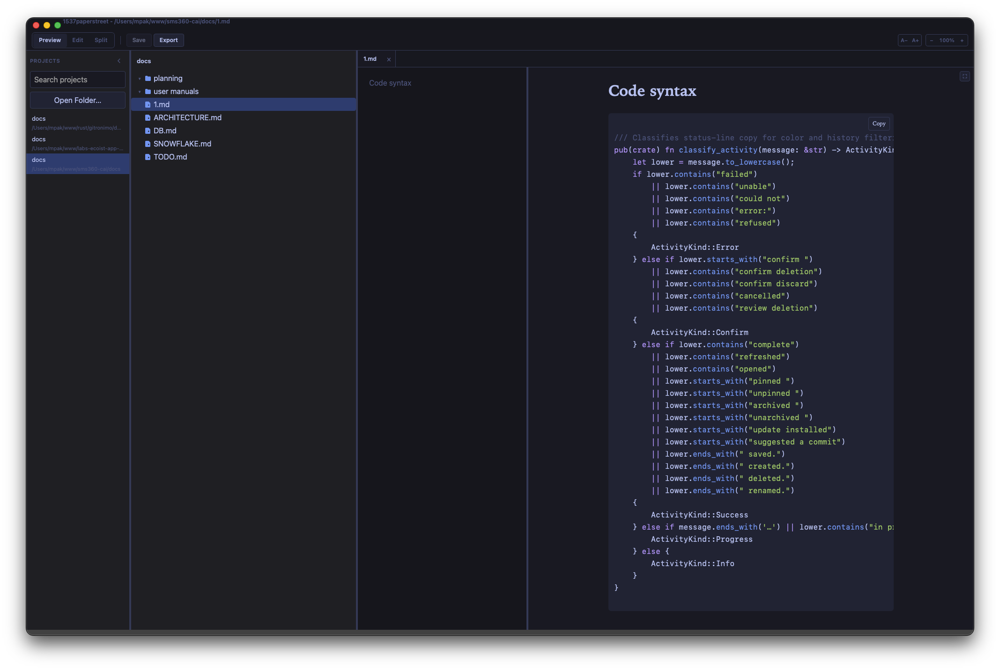
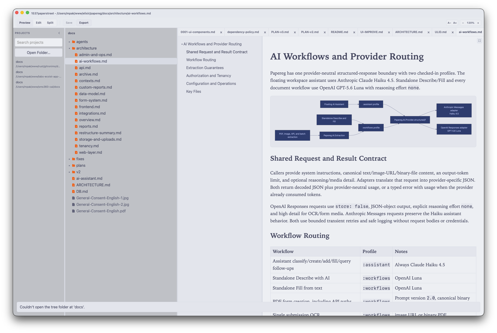
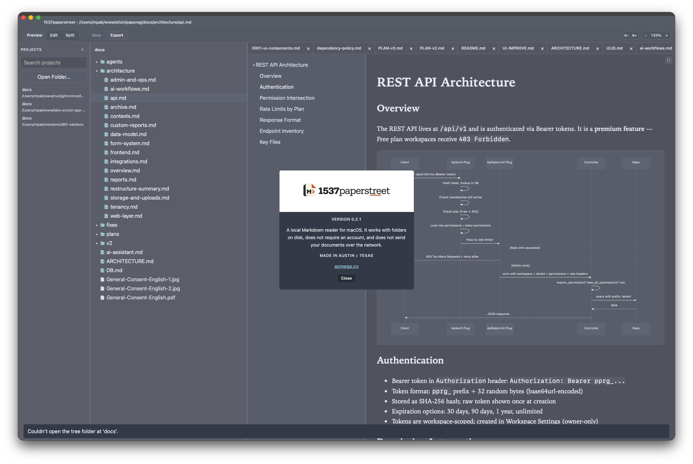

# 1537paperstreet

1537paperstreet is a local Markdown reader for macOS. It works with folders on
disk, does not require an account, and does not send document contents over the
network.

The app reads and lightly edits files you already have: projects on the left,
a file tree in the middle, preview on the right. Preview, Edit, and Split live
in the bar under the title. To use another editor, Open in External Editor
(⌘⇧O) — the tree picks up disk changes on its own.

Next: [install](install.md), [first project](first-project.md).
