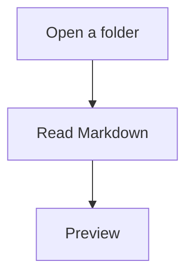

# Mermaid

Блок с языком `mermaid` рендерится в превью, когда диаграмма почти попала
в кадр (запас 400 px). Библиотека подгружается локально, без сети.

````markdown

````

Клик по диаграмме открывает модальное окно: зум колёсиком, панорама перетаскиванием,
Copy SVG, Save PNG (нативный диалог сохранения).

Если синтаксис неверный, под блоком показывается сообщение и исходник. Остальная
страница не ломается.

Готовый SVG кэшируется на диске по хешу исходника и идентификатору темы
(`~/.1537paperstreet/cache/mermaid/`). Смена темы перерисовывает диаграмму.

В Settings можно выключить Mermaid. Тогда вместо рисунка — короткое сообщение,
что диаграммы отключены.
