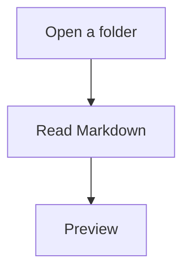

# Mermaid

A `mermaid` fence renders in the preview when the diagram is nearly on screen
(400 px margin). The library loads locally, with no network.

````markdown

````

Click a diagram to open a modal: wheel zoom, drag to pan, Copy SVG, Save PNG
(native save dialog).

If the syntax is invalid, a message and the source appear under the block.
The rest of the page stays intact.

Finished SVG is cached on disk by source hash and theme id
(`~/.1537paperstreet/cache/mermaid/`). Changing theme redraws the diagram.

Settings can turn Mermaid off. Then you get a short note that diagrams are
disabled instead of a drawing.
